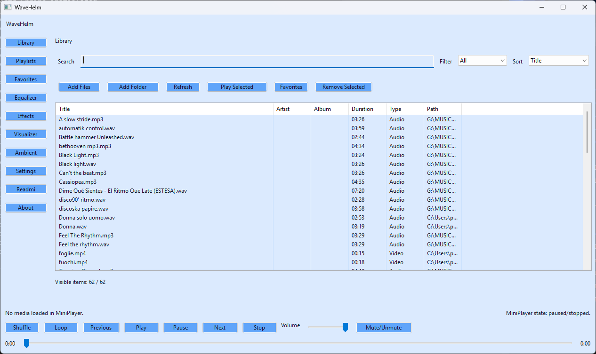
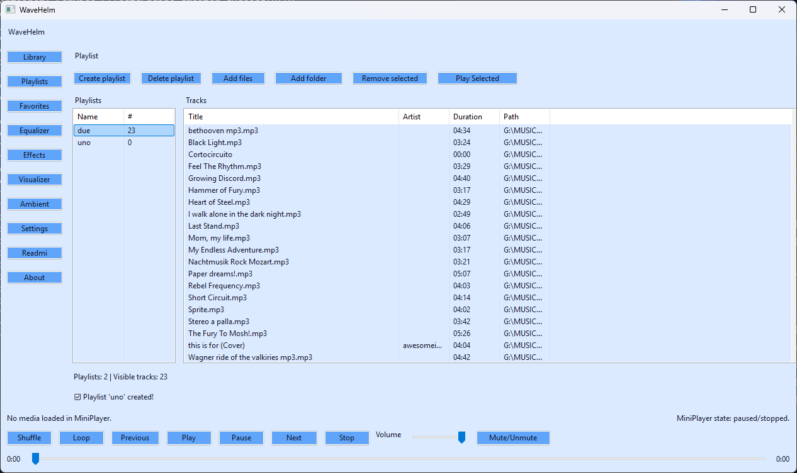
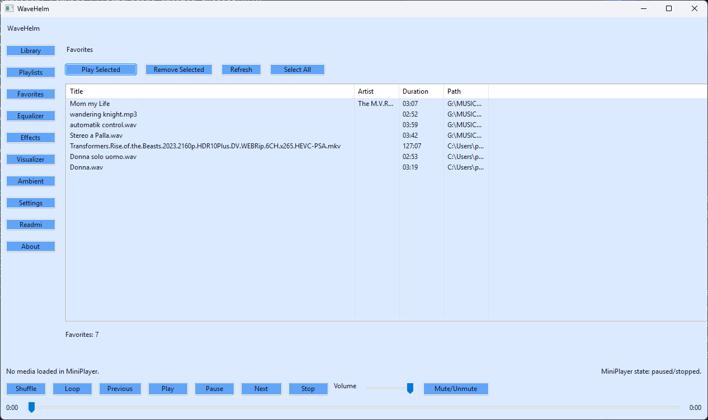
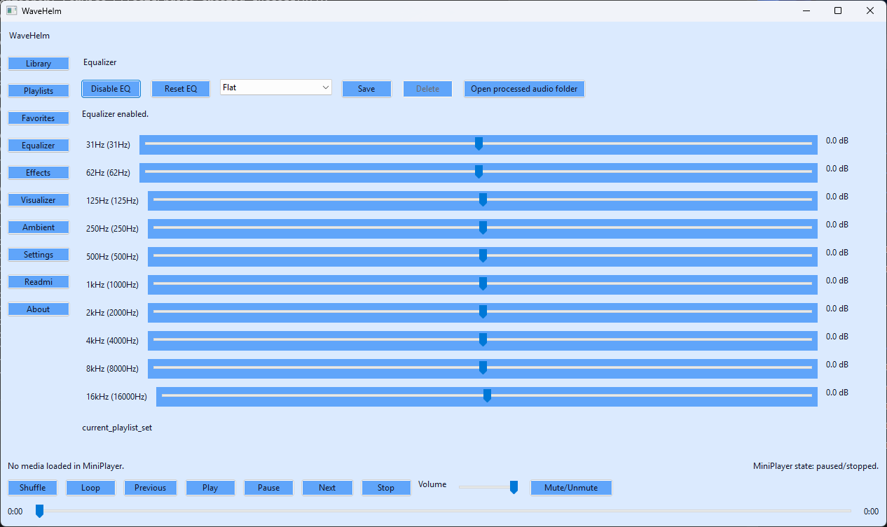
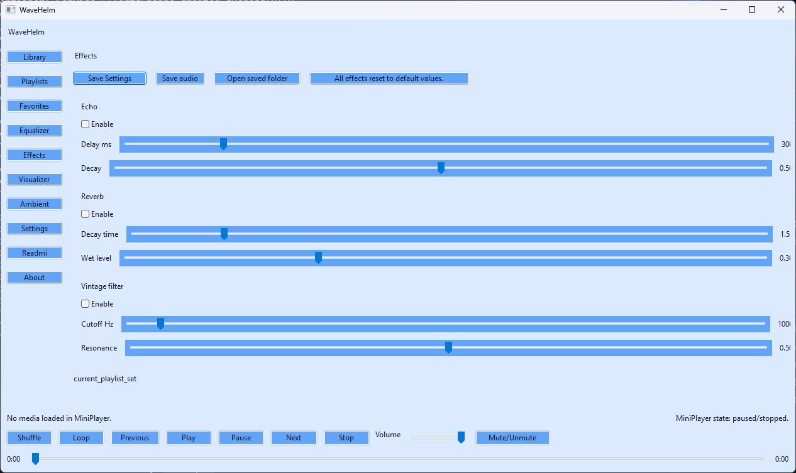
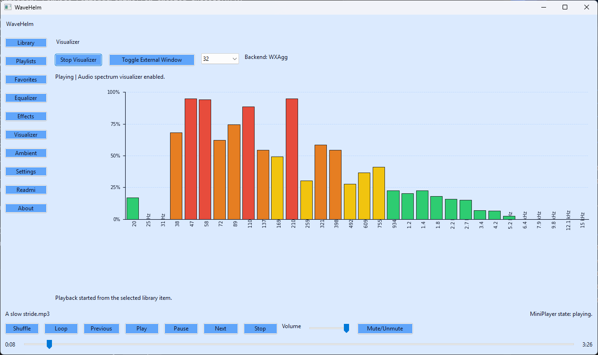
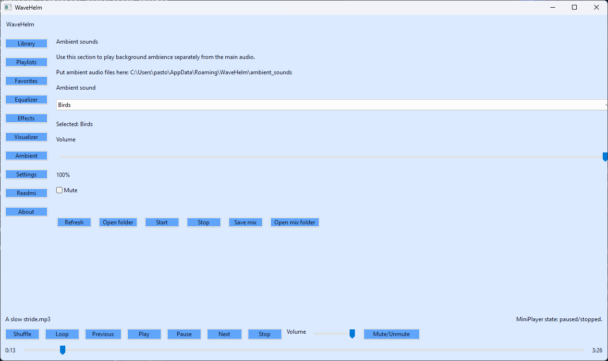
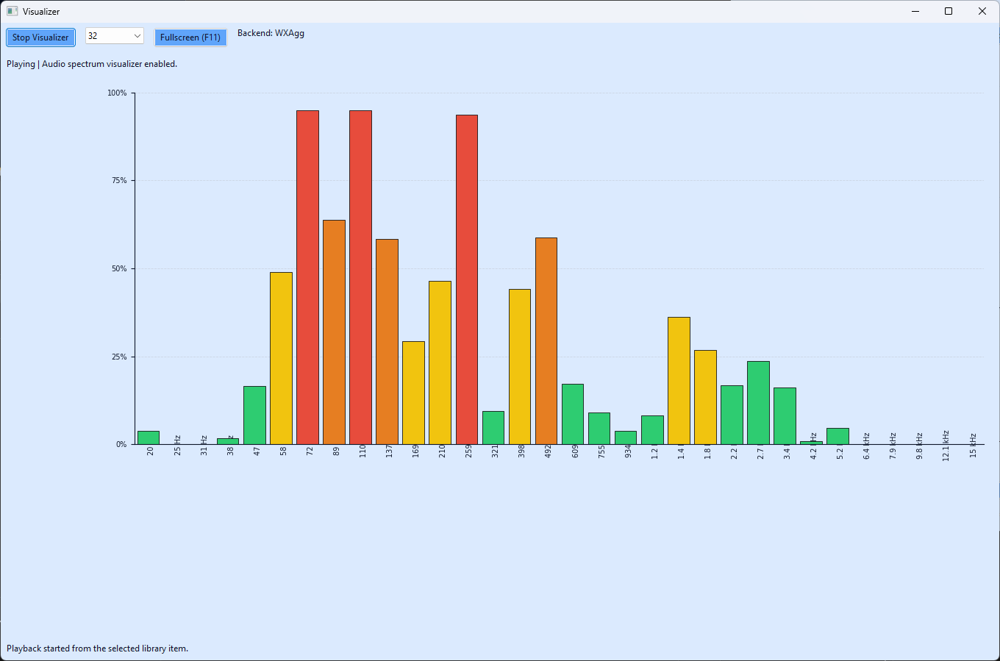
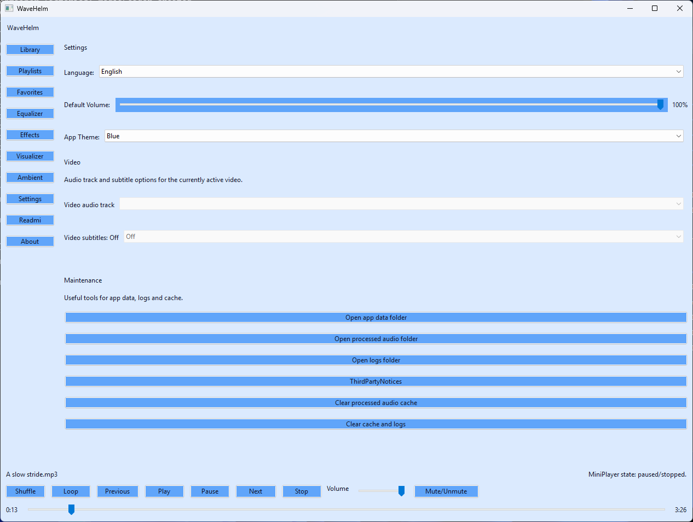
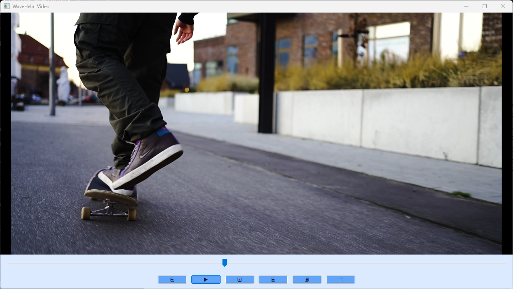

# WaveHelm

WaveHelm is a Windows desktop media player that combines local audio and video playback, DSP audio tools, ambient playback, playlists, favorites, and a real-time visualizer in a wxPython application shell.

This repository is the public **source-first** edition of the project. The codebase is intended to show the product architecture, feature scope, and implementation direction of WaveHelm, while remaining usable for local source-based runs on Windows.

## Why this project exists

WaveHelm was built to explore a practical question: how far a single product can be pushed by combining human product direction with AI-assisted implementation.

The project focuses on:

* a full desktop media-player workflow instead of a narrow demo
* a maintained Windows runtime with Media Foundation video playback
* integrated DSP tools such as equalizer and effects
* a separate ambient playback layer for mixed listening sessions
* repository hygiene, test coverage, and documentation strong enough for public review

## Project status

* **Target platform:** Windows
* **Maintained UI runtime:** wxPython
* **Current source release:** 1.0.1
* **Project maturity:** public GPL source release / active beta
* **Repository model:** source-first public repository
* **Planned convenience distribution:** possible future Microsoft Store release, handled separately from this repository baseline

## Public project website

This repository now includes a GitHub Pages-ready public site in `docs/`.

Published public URLs:

* **Home:** `https://1981-teck.github.io/WaveHelm/`
* **Privacy policy:** `https://1981-teck.github.io/WaveHelm/privacy-policy.html`
* **Applicable license terms:** `https://1981-teck.github.io/WaveHelm/license-terms.html`
* **Source code and licenses:** `https://1981-teck.github.io/WaveHelm/source-code-and-licenses.html`
* **Support:** `https://1981-teck.github.io/WaveHelm/support.html`

GitHub Pages is published from **main** → **/docs**.

## Screenshots

### Main library and playback







### Audio shaping and ambient workflow









### Visualizer, settings, and video runtime








## Original author and project direction

WaveHelm is an **AI-assisted software project directed by Pastoris Marco Vincenzo**.

In practical terms, the original project direction includes:

* concept and product direction
* AI orchestration
* architectural guidance and trade-off decisions
* validation and iterative refinement
* release direction and repository/publication choices

The code was produced through iterative AI-assisted development under human supervision and selection, not through unsupervised autonomous generation.

## Licensing and attribution

WaveHelm is released under **GNU GPL v3.0 or later**.

Additional terms under **GPLv3 section 7** also apply. In short, redistributed and modified versions must:

* preserve reasonable original authorship attribution to **Pastoris Marco Vincenzo**;
* mark modified versions as **modified / unofficial** in a reasonable and visible way;
* avoid using the **WaveHelm** name, branding, or the author's name to imply official status or endorsement without separate permission.

The full wording is provided in [`GPL_SECTION7_ADDITIONAL_TERMS.md`](GPL_SECTION7_ADDITIONAL_TERMS.md). WaveHelm already preserves authorship through the About / Info view and through accessible legal-notices material shipped with the application.

## Maintained feature set

### Core playback

* Play local **audio and video** files from the library, playlists, favorites, or direct selection flows.
* Use the footer **mini-player** across the whole shell for:

  * play
  * pause
  * stop
  * previous / next
  * seek through the current item
  * shuffle
  * loop
  * volume
  * mute
* View the current title, playback state, elapsed time, and total duration directly in the mini-player.
* Switch quickly between audio and video items during the same session.

### Library

The **Library** page is the main catalog for local media.

It supports:

* importing **files**
* importing whole **folders**
* **searching** the catalog
* **filtering** by media type
* **sorting** by title, artist, album, or duration
* **refreshing** the current list
* **playing** the selected item
* adding the selected item(s) to **Favorites**
* **removing** selected entries from the library
* double-click activation for direct playback
* highlighting the **currently playing** item with a dedicated row color
* remembering the table **column widths** between sessions

### Playlists

The **Playlist** page separates playlist management from track management.

It supports:

* creating playlists
* deleting playlists
* adding **files** to the selected playlist
* adding whole **folders** to the selected playlist
* removing selected tracks from the active playlist
* playing the selected track from the active playlist
* persistent playlist storage between sessions
* highlighting the **currently playing** item in the playlist track table
* remembering both playlist-table and track-table **column widths** between sessions

### Favorites

The **Favorites** page is the fast-access area for saved media.

It supports:

* reopening favorite items for playback
* removing selected favorites
* refreshing the current favorites list
* selecting all visible favorites with one action
* highlighting the **currently playing** favorite row
* remembering table **column widths** between sessions

### Equalizer

The **Equalizer** page provides the maintained EQ workflow.

It supports:

* enabling or disabling EQ
* adjusting the available **frequency bands**
* selecting built-in presets
* saving the current curve as a **custom preset**
* deleting custom presets
* resetting the EQ curve back to **Flat**
* opening the **processed audio** folder used by DSP-rendered playback assets

Behavior note:

* on application restart, the startup EQ preset returns to **Flat** instead of restoring the last selected preset name

### Effects

The **Effects** page controls the maintained DSP effects path.

It supports:

* configuring **echo**
* configuring **reverb**
* configuring the **vintage filter**
* saving the current effect settings/profile
* resetting all active effects
* exporting the current processed audio session to **WAV**
* opening the **effects saved** export folder directly from the page

### Visualizer

The **Visualizer** page provides the maintained spectrum display.

It supports:

* starting or stopping the visualizer
* selecting the **band count**
* showing the spectrum inside the page
* opening a **detached external visualizer window**
* toggling visualizer fullscreen in the detached window with **F11**
* falling back to a simpler compatibility canvas when the preferred plotting backend is unavailable

### Ambient playback

The **Ambient** page controls an audio layer separate from the main queue.

It supports:

* loading ambient items from the dedicated ambient folder
* refreshing the available ambient list
* opening the ambient source folder
* selecting an ambient sound, spoken-word file, or song overlay
* starting and stopping ambient playback independently from the main track
* adjusting **ambient volume**
* muting or unmuting the ambient layer
* exporting the current session plus the ambient overlay to **WAV**
* opening the **ambient mix saved** folder directly from the page

### Settings and maintenance

The **Settings** page centralizes preferences, video track selection, and maintenance tools.

It supports:

* changing the current **language**
* changing the current **theme**
* adjusting the persistent **master volume**
* selecting the active **video audio track** when a compatible video session is active
* selecting the active **subtitle track** when a compatible video session is active
* opening the **app data** folder
* opening the **processed audio** folder
* opening the **logs** folder
* opening the runtime **third-party notices** bundle
* clearing the **processed audio cache**
* clearing general runtime artifacts such as cache and logs

### Readmi and About

* **Readmi** shows the built-in user manual in the active language and current theme.
* **About** shows version, author, license, target platform, website, enabled modules, bundled libraries, and contact information.
* The **About** page can export application metadata to JSON.

## Application map

The maintained wx shell exposes these sections:

* **Library**
* **Playlist**
* **Favorites**
* **Equalizer**
* **Effects**
* **Visualizer**
* **Ambient**
* **Settings**
* **Readmi**
* **About**

The footer mini-player remains active across the shell.

## Quick start

1. Open **Library** and import one or more local files or folders.
2. Start playback from the library, a playlist, or favorites.
3. Use the footer **mini-player** for transport, seek, shuffle, loop, mute, and volume.
4. Open **Equalizer**, **Effects**, or **Ambient** to shape the listening session.
5. Open **Visualizer** if you want a live spectrum view or a detached fullscreen visualizer window.
6. Open **Settings** for language, theme, video track selection, maintenance actions, and runtime folders.
7. Open **Readmi** for the localized in-app manual or **About** for runtime identity and exported metadata.

## Playback behavior and media notes

* Audio and video can be switched quickly in the same session.
* Video playback depends on **Windows COM** and **Media Foundation**.
* The current build uses an **external-only** video host instead of an embedded in-app video page.
* Audio and subtitle track selection live in **Settings** instead of a dedicated video page.
* DSP-enabled playback can render processed copies into a `processed_audio` cache.
* The visualizer can run either embedded in the page or in a detached window.
* Library, Playlist, and Favorites can keep the active item visually highlighted while playback continues elsewhere in the shell.

## Data, logs, exports, and persistence

On Windows, WaveHelm stores runtime data under `%APPDATA%\WaveHelm`.
Typical files and folders include:

* `settings.json` for user settings
* `wavehelm.db` for the SQLite persistence layer used by library, playlists, favorites, presets, and related runtime data
* `logs\wavehelm.log` for application logs
* `processed_audio\` for DSP-rendered playback cache files
* `ambient mix saved\` for WAV files exported from the Ambient page
* `effects saved\` for WAV files exported from the Effects page
* `exports\wavehelm_app_info.json` for metadata exported from the About page
* `licenses\` for the runtime third-party notices bundle

Persistence includes:

* playlists
* favorites
* settings
* custom EQ presets
* master volume
* table column widths in Library, Playlist, and Favorites

Managed logs are rotated automatically, and cleanup tools can remove cached/runtime artifacts when requested.

## Compatibility Matrix

|Area|Status|Notes|
|-|-|-|
|Operating system|Supported target: Windows|Video playback depends on Windows COM and Media Foundation APIs.|
|macOS / Linux|Not supported|The repository can be browsed and partially tested elsewhere, but the product target is not cross-platform.|
|Python|`>=3.11`|Recommended runtime for this repository is Python 3.12.|
|UI toolkit|`wxPython`|Maintained UI runtime.|
|Audio stack|`pygame`, `soundfile`, `numpy`, `scipy`|Required for playback and DSP features.|
|Video stack|Windows Media Foundation, `comtypes`, `pywin32`|Required for the current video backend.|
|Optional external tool|`ffprobe` in `PATH`|Optional, but improves media duration probing for some formats.|

## Native and video dependencies

WaveHelm is not a pure-Python application. The current runtime expects:

* Windows APIs available at runtime, especially COM and Media Foundation
* `pywin32` for Win32 integration
* `comtypes` for COM interop
* `wxPython` for the application shell and pages
* `ffprobe` only as an optional helper; the app still runs without it, but some duration probing falls back to less accurate paths

If you distribute a frozen build, treat the video branch as Windows-only and verify it on a real Windows machine with Media Foundation enabled.

## Install and run from source

For full setup instructions, see [INSTALL_WINDOWS.md](INSTALL_WINDOWS.md).

Quick path:

```powershell
python -m venv .venv
.venv\Scripts\Activate.ps1
python -m pip install --upgrade pip
python -m pip install -r requirements.txt
python main.py
```

The optional `--ui-backend wx` flag is still accepted for CLI compatibility, but wx is now the only supported backend.

## Run tests

Install the development requirements and run the complete source test suite:

```powershell
python -m pip install -r requirements-dev.txt
python -m pytest -q tests
```

The GitHub/source release retains all test code under `tests/`. Runtime directories, SQLite databases, logs, caches, and media stubs generated by the tests are reproducible outputs and are excluded from release archives.

## Public roadmap

See [ROADMAP.md](ROADMAP.md) for the short-term engineering roadmap and [CHANGELOG.md](CHANGELOG.md) for release changes.

## Source distribution baseline

This repository is maintained as a **source-first Windows project**.

The repository includes:

* [pyproject.toml](pyproject.toml) with project metadata and installable entry point metadata
* [requirements.txt](requirements.txt) and [requirements-dev.txt](requirements-dev.txt) with pinned runtime and development tooling
* [MANIFEST.in](MANIFEST.in) for source-distribution inclusions
* the complete source test suite under [tests](tests)
* GitHub Actions validation under [.github/workflows](.github/workflows)
* [docs/windows-packaging.md](docs/windows-packaging.md) with Windows runtime notes, required assets, and native dependency guidance for local source-based execution
* a baseline legal notices bundle aligned to the maintained wx-only runtime stack

Out of scope for this repository baseline:

* prebuilt executable artifacts
* repository-maintained installer workflows
* signed release automation

The repository now includes curated UI screenshots under [docs/screenshots](docs/screenshots) for GitHub presentation.

## Contributing and collaboration

WaveHelm is published to make the project visible, reviewable, and credible as a public technical showcase, while remaining open to useful fixes and review.

At this stage, useful public collaboration includes:

* bug reports
* documentation corrections
* UI feedback
* Windows runtime validation
* targeted implementation suggestions

Before opening larger structural changes, keep them aligned with the current Windows-only and wx-only maintained baseline.

## License

WaveHelm is distributed under the **GNU General Public License v3.0 or later**.
See [LICENSE](LICENSE) for the complete license text.

## Repository layout

* [main.py](main.py): thin entrypoint
* [src](src): application code
* [src/config/app_info.json](src/config/app_info.json): product metadata consumed by runtime and About
* [src/resources/manual](src/resources/manual): localized in-app manual resources rendered by the Readmi view
* [docs/screenshots](docs/screenshots): curated GitHub screenshots of the maintained UI
* [ambient_sounds](ambient_sounds): placeholder folder for user-provided ambient media in the public repository
* [tests](tests): test suite
* [AUTHORS](AUTHORS): original project authorship and attribution notes
* [ROADMAP.md](ROADMAP.md): short-term public roadmap

